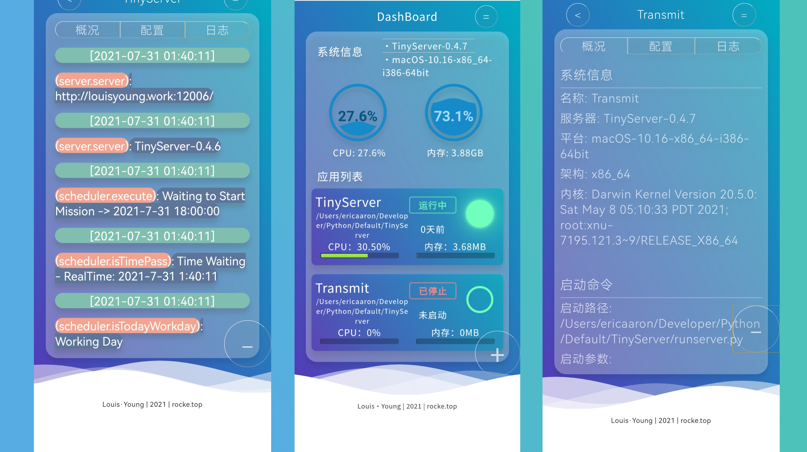
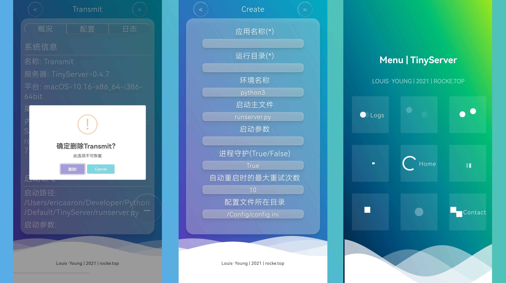

# TinyServerManage

#### 1. 介绍
​		云原生时代的采用web ui实现serverless进程管理器，可查看应用进程概况，进程性能监视，系统资源情况，并可启动/关闭项目进程，类似python-supervisor

##### 演示



#### 2. 主要功能
- 通过web管理服务器运行的Python项目
- 系统概况
- 应用列表
- 添加应用
- 删除应用
- 配置查看
- 日志查看

#### 3. 基本模块

- Core
  - main.py - 程序执行的入口
- Config
  - config.ini - 填写基本配置信息
  - settings.py - 对config.ini中数据进行读取与初始化
- Logger
  - logger - 输出日志信息到控制台、日志文件与Server模块
- Message
  - message - 消息传递接口，可通过QQ机器人与邮箱发送信息
- Scheduler
  - scheduler - 定时执行模块，在config.ini 中开启并设置后，定时执行/Core/main.py中代码
- Server
  - handler - 包含主要的HTTP请求处理与api
  - server - 用于配置并启动服务器线程
  - url - 用于配置api路径
  - api - 用于配置json api
- Static
  - web网页查看日志
  - Restful api提供项目信息接口
- Task
  - task - 任务列表管理
  - application - 虚拟Python应用类

#### 4. 运行环境

- [Python 3](https://www.python.org/)

#### 5. 安装教程

1. ```shell
   git clone https://gitee.com/louisyoung1/tiny-server-manage.git
   ```

2. ```sh
   cd tiny-server-manage
   ```

#### 6. 使用说明

1. 修改/Core/main.py中代码，修改为你要运行的代码

2. 按注释要求编辑/Config/config.ini文件中配置项
   
3. 确保你此时在/tiny-server-manage目录下，并安装依赖
   ```sh
   python3 -m pip install -r requirements.txt
   ```
   
4. 启动项目运行(需要root权限，sudo启动)

   ```sh
   sudo python3 runserver
   ```

#### 7. 目录结构

```shell
.
├── Config
│   ├── __init__.py
│   ├── config.ini
│   └── settings.py
├── Core
│   ├── __init__.py
│   └── core.py
├── Logger
│   ├── Log_Files
│   │   ├── TaskList.json
│   │   └── TinyServerManager.log
│   ├── __init__.py
│   └── logger.py
├── Message
│   ├── __init__.py
│   └── message.py
├── Scheduler
│   ├── __init__.py
│   └── scheduler.py
├── Server
│   ├── __init__.py
│   ├── api.py
│   ├── handler.py
│   ├── server.py
│   └── url.py
├── Static
│   ├── 404.html
│   ├── contact.html
│   ├── create.html
│   ├── css
│   │   ├── contact.css
│   │   ├── create.css
│   │   ├── dashboard.css
│   │   ├── log.css
│   │   ├── menu.css
│   │   ├── task.css
│   │   └── waves.css
│   ├── favicon.ico
│   ├── images
│   │   └── LOUIS-LOGO-NEW@0.5x.png
│   ├── index.html
│   ├── js
│   │   ├── axios.min.js
│   │   ├── contact.js
│   │   ├── create.js
│   │   ├── d3.js
│   │   ├── dashboard-chart.js
│   │   ├── dashboard.js
│   │   ├── init.js
│   │   ├── log.js
│   │   ├── menu.js
│   │   └── task.js
│   ├── log.html
│   ├── menu.html
│   └── task.html
├── TEST
│   ├── http_example.py
│   ├── log_example.py
│   ├── logs_old.py
│   ├── static_test.py
│   └── subprocess.txt
├── Task
│   ├── __init__.py
│   ├── application.py
│   └── task.py
├── requirements.txt
└── runserver.py
```


#### 8. 参与贡献

1.  Fork 本仓库
2.  新建 Feat_xxx 分支
3.  提交代码
4.  新建 Pull Request
